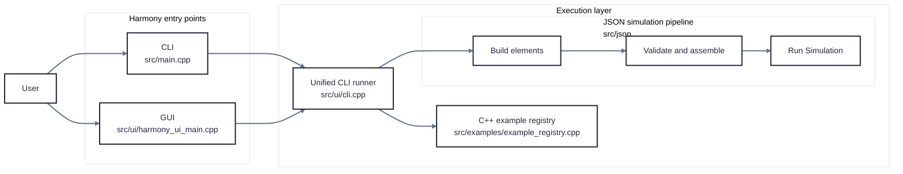

```mermaid
---
config:
  theme: redux-color
  themeVariables:
    lineColor: '#64748B'
---
flowchart LR
 subgraph ENTRY["Harmony entry points"]
        CLI["CLI<br>src/main.cpp"]
        GUI["GUI<br>src/ui/harmony_ui_main.cpp"]
  end
 subgraph JSONPIPE["JSON simulation pipeline<br>src/json"]
        J1["Build elements"]
        J2["Validate and assemble"]
        J3["Run Simulation"]
  end
 subgraph RUN["Execution layer"]
        RUNNER["Unified CLI runner<br>src/ui/cli.cpp"]
        CPPREG["C++ example registry<br>src/examples/example_registry.cpp"]
        JSONPIPE
  end
    J1 --> J2
    J2 --> J3
    USER["User"] --> CLI & GUI
    CLI --> RUNNER
    GUI --> RUNNER
    RUNNER --> CPPREG & J1
```
