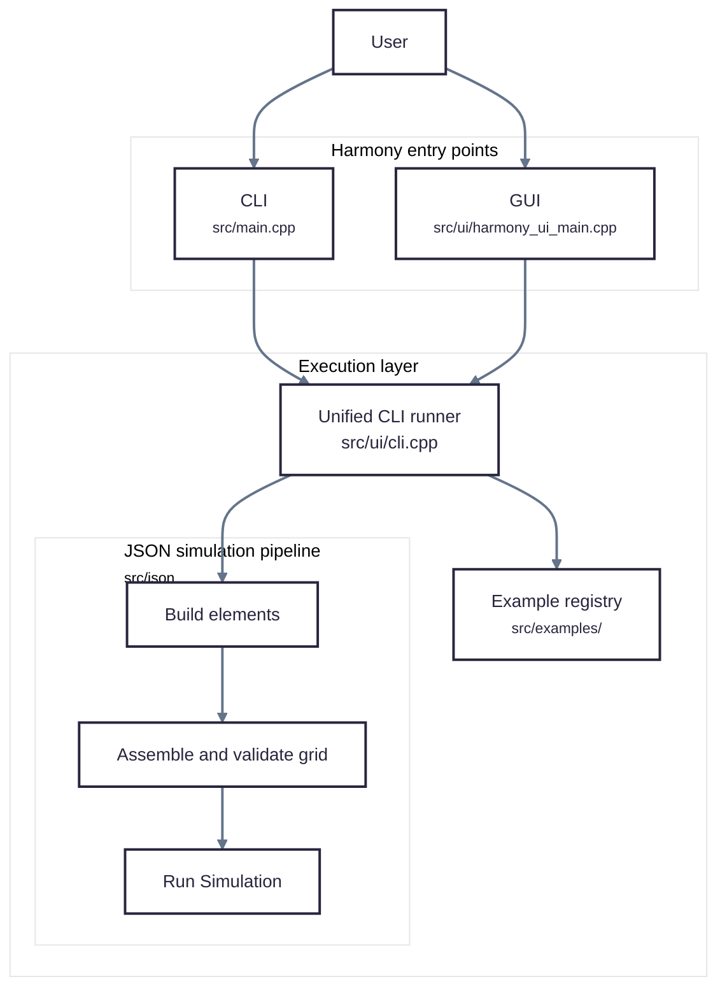

```mermaid
---
config:
  theme: redux-color
  themeVariables:
    lineColor: '#64748B'
---
flowchart
  subgraph ENTRY["Harmony entry points"]
    CLI["CLI<br><small>src/main.cpp</small>"]
    GUI["GUI<br><small>src/ui/harmony_ui_main.cpp</small>"]
  end
  subgraph RUN["Execution layer"]
    RUNNER["Unified CLI runner<br>src/ui/cli.cpp"]
    CPPREG["Example registry<br><small>src/examples/</small>"]
    JSONPIPE
  end
  subgraph JSONPIPE["JSON simulation pipeline<br><small>src/json</small>"]
    J1["Build elements"]
    J2["Assemble and validate grid"]
    J3["Run Simulation"]
  end
  J1 --> J2
  J2 --> J3
  USER["User"] --> CLI & GUI
  CLI --> RUNNER
  GUI --> RUNNER
  RUNNER --> CPPREG & J1
```
