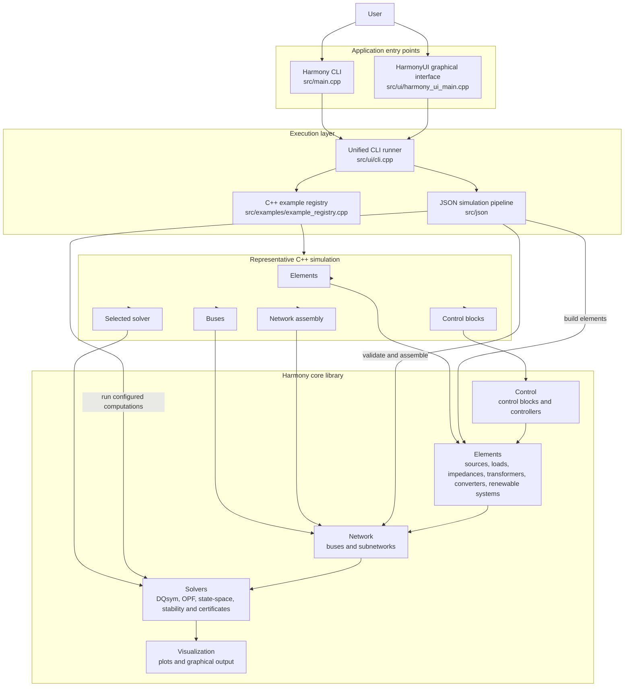

```mermaid
flowchart TD
    USER["User"]

    subgraph ENTRY["Application entry points"]
        CLI["Harmony CLI<br/>src/main.cpp"]
        GUI["HarmonyUI graphical interface<br/>src/ui/harmony_ui_main.cpp"]
    end

    subgraph RUN["Execution layer"]
        RUNNER["Unified CLI runner<br/>src/ui/cli.cpp"]
        CPPREG["C++ example registry<br/>src/examples/example_registry.cpp"]
        JSON["JSON simulation pipeline<br/>src/json"]
    end

    subgraph CORE["Harmony core library"]
        ELEMENTS["Elements<br/>sources, loads, impedances, transformers, converters, renewable systems"]
        CONTROL["Control<br/>control blocks and controllers"]
        NETWORK["Network<br/>buses and subnetworks"]
        SOLVERS["Solvers<br/>DQsym, OPF, state-space, stability and certificates"]
        VIS["Visualization<br/>plots and graphical output"]
    end

    subgraph EXAMPLE["Representative C++ simulation"]
        EXELEMENT["Elements"]
        EXCONTROL["Control blocks"]
        EXBUS["Buses"]
        EXNETWORK["Network assembly"]
        EXSOLVER["Selected solver"]
    end

    USER --> CLI
    USER --> GUI
    CLI --> RUNNER
    GUI --> RUNNER

    RUNNER --> CPPREG
    RUNNER --> JSON

    CPPREG --> EXAMPLE
    EXAMPLE --> EXELEMENT
    EXAMPLE --> EXCONTROL
    EXAMPLE --> EXBUS
    EXAMPLE --> EXNETWORK
    EXAMPLE --> EXSOLVER

    EXELEMENT --> ELEMENTS
    EXCONTROL --> CONTROL
    EXBUS --> NETWORK
    EXNETWORK --> NETWORK
    EXSOLVER --> SOLVERS

    JSON -->|"validate and assemble"| NETWORK
    JSON -->|"build elements"| ELEMENTS
    JSON -->|"run configured computations"| SOLVERS

    ELEMENTS --> NETWORK
    CONTROL --> ELEMENTS
    NETWORK --> SOLVERS
    SOLVERS --> VIS
```
