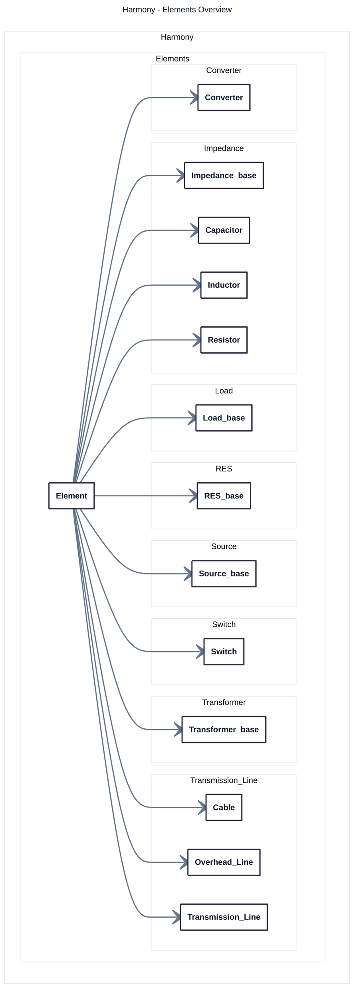
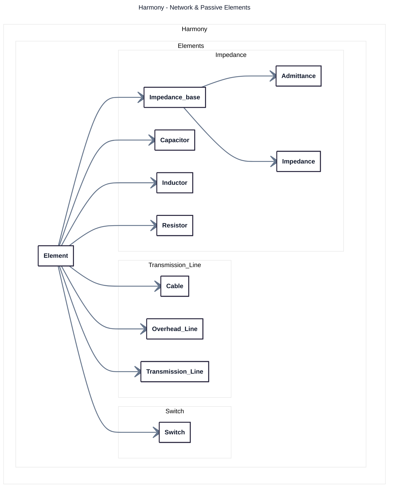
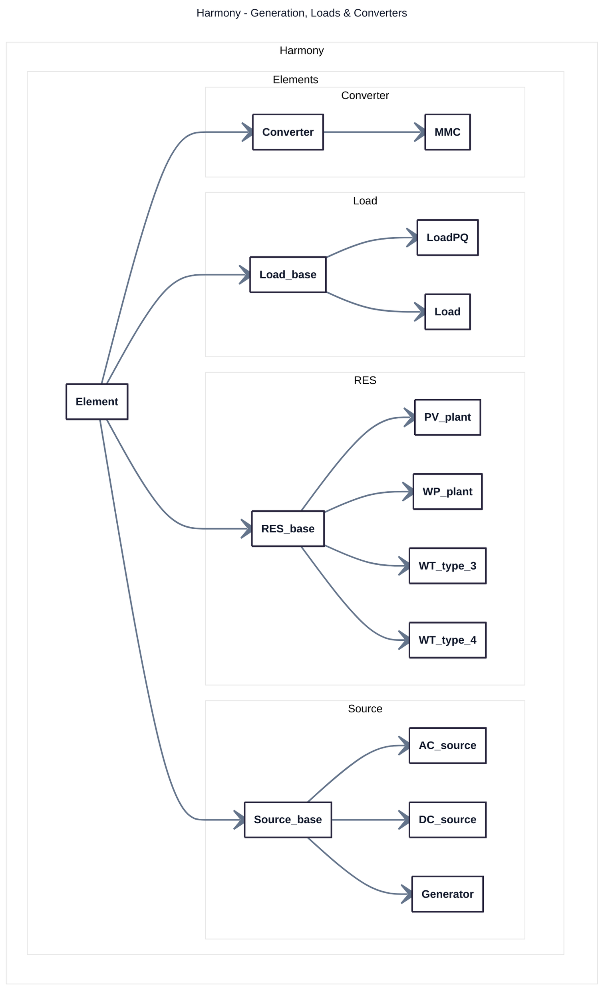
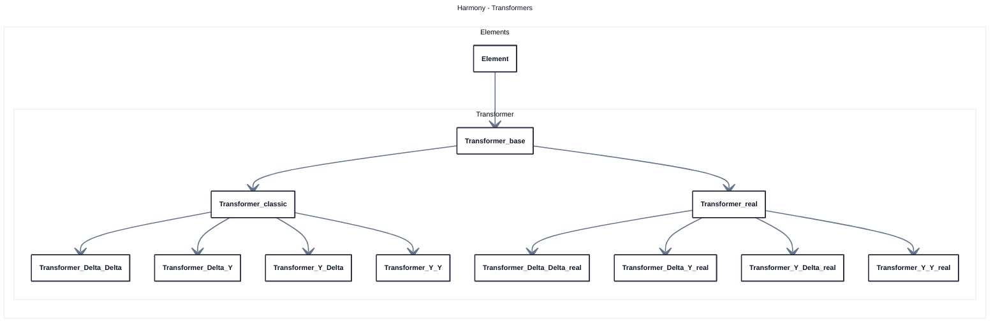

## Elements Overview

```mermaid
---
title: Harmony - Elements Overview
config:
  theme: redux-color
  themeVariables:
    fontFamily: Inter, Segoe UI, sans-serif
    lineColor: "#64748B"
    primaryTextColor: "#0F172A"
  class:
    hideEmptyMembersBox: true
---
classDiagram
  direction LR

  namespace Harmony.Elements {
    class Element {}
  }

  namespace Harmony.Elements.Converter {
    class Converter {}
  }
  Element --> Converter

  namespace Harmony.Elements.Impedance {
    class Impedance_base {}
    class Capacitor {}
    class Inductor {}
    class Resistor {}
  }
  Element --> Impedance_base
  Element --> Capacitor
  Element --> Inductor
  Element --> Resistor

  namespace Harmony.Elements.Load {
    class Load_base {}
  }
  Element --> Load_base

  namespace Harmony.Elements.RES {
    class RES_base {}
  }
  Element --> RES_base

  namespace Harmony.Elements.Source {
    class Source_base {}
  }
  Element --> Source_base

  namespace Harmony.Elements.Switch {
    class Switch {}
  }
  Element --> Switch

  namespace Harmony.Elements.Transformer {
    class Transformer_base {}
  }
  Element --> Transformer_base

  namespace Harmony.Elements.Transmission_Line {
    class Cable {}
    class Overhead_Line {}
    class Transmission_Line {}
  }
  Element --> Cable
  Element --> Overhead_Line
  Element --> Transmission_Line
```

## Network and Passive Elements

```mermaid
---
title: Harmony - Network & Passive Elements
config:
  theme: redux-color
  themeVariables:
    fontFamily: Inter, Segoe UI, sans-serif
    lineColor: "#64748B"
    primaryTextColor: "#0F172A"
  class:
    hideEmptyMembersBox: true
---
classDiagram
  direction LR

  namespace Harmony.Elements {
    class Element {}
  }

  namespace Harmony.Elements.Impedance {
    class Impedance_base {}
    class Admittance {}
    class Impedance {}
    class Capacitor {}
    class Inductor {}
    class Resistor {}
  }
  Element --> Impedance_base
  Element --> Capacitor
  Element --> Inductor
  Element --> Resistor
  Impedance_base --> Admittance
  Impedance_base --> Impedance

  namespace Harmony.Elements.Transmission_Line {
    class Cable {}
    class Overhead_Line {}
    class Transmission_Line {}
  }
  Element --> Cable
  Element --> Overhead_Line
  Element --> Transmission_Line

  namespace Harmony.Elements.Switch {
    class Switch {}
  }
  Element --> Switch
```

## Generators, Loads and Converters

```mermaid
---
title: Harmony - Generation, Loads & Converters
config:
  theme: redux-color
  themeVariables:
    fontFamily: Inter, Segoe UI, sans-serif
    lineColor: "#64748B"
    primaryTextColor: "#0F172A"
  class:
    hideEmptyMembersBox: true
---
classDiagram
  direction LR

  namespace Harmony.Elements {
    class Element {}
  }

  namespace Harmony.Elements.Converter {
    class Converter {}
    class MMC {}
  }
  Element --> Converter
  Converter --> MMC

  namespace Harmony.Elements.Load {
    class Load_base {}
    class LoadPQ {}
    class Load {}
  }
  Element --> Load_base
  Load_base --> LoadPQ
  Load_base --> Load

  namespace Harmony.Elements.RES {
    class PV_plant {}
    class RES_base {}
    class WP_plant {}
    class WT_type_3 {}
    class WT_type_4 {}
  }
  Element --> RES_base
  RES_base --> PV_plant
  RES_base --> WP_plant
  RES_base --> WT_type_3
  RES_base --> WT_type_4

  namespace Harmony.Elements.Source {
    class Source_base {}
    class AC_source {}
    class DC_source {}
    class Generator {}
  }
  Element --> Source_base
  Source_base --> AC_source
  Source_base --> DC_source
  Source_base --> Generator
```

## Transformers

```mermaid
---
title: Harmony - Transformers
config:
  theme: redux-color
  themeVariables:
    fontFamily: Segoe UI, -apple-system, BlinkMacSystemFont, sans-serif
    lineColor: "#64748B"
    primaryTextColor: "#0F172A"
  flowchart:
    wrappingWidth: 450
  class:
    hideEmptyMembersBox: true
    padding: 16
---
classDiagram
  direction LR

  namespace Elements {
    class Element {}
  }

  namespace Elements.Transformer {
    class Transformer_base {}
    class Transformer_classic {}
    class Transformer_Delta_Delta_real {}
    class Transformer_Delta_Delta {}
    class Transformer_Delta_Y_real {}
    class Transformer_Delta_Y {}
    class Transformer_real {}
    class Transformer_Y_Delta_real {}
    class Transformer_Y_Delta {}
    class Transformer_Y_Y_real {}
    class Transformer_Y_Y {}
  }
  Element --> Transformer_base
  Transformer_base --> Transformer_classic
  Transformer_base --> Transformer_real
  Transformer_classic --> Transformer_Delta_Delta
  Transformer_classic --> Transformer_Delta_Y
  Transformer_classic --> Transformer_Y_Delta
  Transformer_classic --> Transformer_Y_Y
  Transformer_real --> Transformer_Delta_Delta_real
  Transformer_real --> Transformer_Delta_Y_real
  Transformer_real --> Transformer_Y_Delta_real
  Transformer_real --> Transformer_Y_Y_real
```
