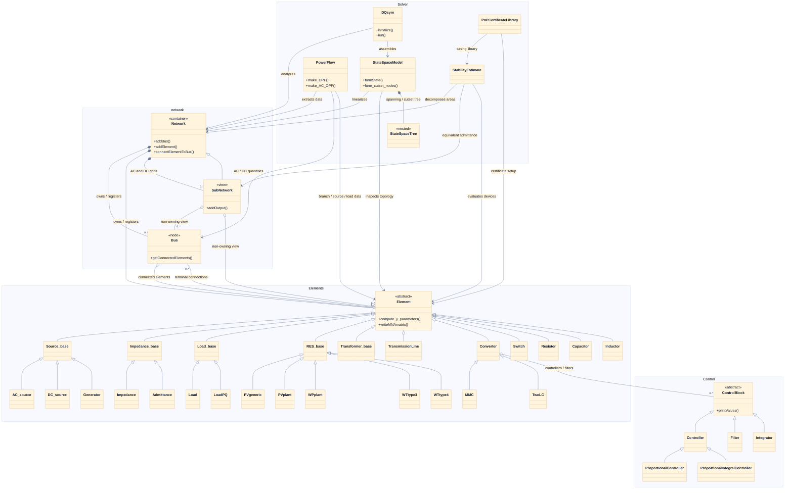

```mermaid
%%{init: {"theme": "base", "themeVariables": {"fontFamily": "Inter, Segoe UI, sans-serif", "lineColor": "#64748B", "primaryTextColor": "#0F172A"}}}%%
classDiagram
    direction TB

    namespace network {
        class Network {
            <<container>>
            +addBus()
            +addElement()
            +connectElementToBus()
        }
        class SubNetwork {
            <<view>>
            +addOutput()
        }
        class Bus {
            <<node>>
            +getConnectedElements()
        }
    }

    namespace Elements {
        class Element {
            <<abstract>>
            +compute_y_parameters()
            +writeMNAmatrix()
        }
        class Source_base
        class Impedance_base
        class Load_base
        class RES_base
        class Transformer_base
        class TransmissionLine
        class Converter
        class Switch
        class MMC
        class TwoLC
        class AC_source
        class DC_source
        class Generator
        class Resistor
        class Capacitor
        class Inductor
        class Impedance
        class Admittance
        class Load
        class LoadPQ
        class PVgeneric
        class PVplant
        class WPplant
        class WTtype3
        class WTtype4
    }

    namespace Control {
        class ControlBlock {
            <<abstract>>
            +printValues()
        }
        class Controller
        class Filter
        class Integrator
        class ProportionalController
        class ProportionalIntegralController
    }

    namespace Solver {
        class StateSpaceModel {
            +formState()
            +form_cutset_nodes()
        }
        class DQsym {
            +initialize()
            +run()
        }
        class PowerFlow {
            +make_OPF()
            +make_AC_OPF()
        }
        class StabilityEstimate
        class PnPCertificateLibrary
        class StateSpaceTree {
            <<nested>>
        }
    }

    Network *-- "0..*" Bus : owns / registers
    Network *-- "0..*" Element : owns / registers
    Network *-- "0..*" SubNetwork : AC and DC grids
    SubNetwork --|> Network
    SubNetwork o-- "0..*" Bus : non-owning view
    SubNetwork o-- "0..*" Element : non-owning view
    Element o-- "0..*" Bus : terminal connections
    Bus o-- "0..*" Element : connected elements

    Element <|-- Source_base
    Element <|-- Impedance_base
    Element <|-- Load_base
    Element <|-- RES_base
    Element <|-- Transformer_base
    Element <|-- TransmissionLine
    Element <|-- Converter
    Element <|-- Switch
    Element <|-- Resistor
    Element <|-- Capacitor
    Element <|-- Inductor

    Impedance_base <|-- Impedance
    Impedance_base <|-- Admittance
    Source_base <|-- AC_source
    Source_base <|-- DC_source
    Source_base <|-- Generator
    Load_base <|-- Load
    Load_base <|-- LoadPQ
    RES_base <|-- PVgeneric
    RES_base <|-- PVplant
    RES_base <|-- WPplant
    RES_base <|-- WTtype3
    RES_base <|-- WTtype4
    Converter <|-- MMC
    Converter <|-- TwoLC

    ControlBlock <|-- Controller
    ControlBlock <|-- Filter
    ControlBlock <|-- Integrator
    Controller <|-- ProportionalController
    Controller <|-- ProportionalIntegralController
    Converter o-- "0..*" ControlBlock : controllers / filters

    DQsym --> Network : analyzes
    DQsym --> StateSpaceModel : assembles
    StateSpaceModel --> Network : linearizes
    StateSpaceModel --> Element : inspects topology
    StateSpaceModel *-- StateSpaceTree : spanning / cutset tree
    PowerFlow --> Network : extracts data
    PowerFlow --> Bus : AC / DC quantities
    PowerFlow --> Element : branch / source / load data
    StabilityEstimate --> Network : decomposes areas
    StabilityEstimate --> SubNetwork : equivalent admittance
    StabilityEstimate --> Element : evaluates devices
    PnPCertificateLibrary --> StabilityEstimate : tuning library
    PnPCertificateLibrary --> Element : certificate setup

    classDef network fill:#DBEAFE,stroke:#2563EB,color:#0F172A,stroke-width:2px
    classDef element fill:#DCFCE7,stroke:#16A34A,color:#14532D,stroke-width:2px
    classDef control fill:#F3E8FF,stroke:#9333EA,color:#581C87,stroke-width:2px
    classDef solver fill:#FFEDD5,stroke:#EA580C,color:#7C2D12,stroke-width:2px

    class Network:::network
    class SubNetwork:::network
    class Bus:::network

    class Element:::element
    class Source_base:::element
    class Impedance_base:::element
    class Load_base:::element
    class RES_base:::element
    class Transformer_base:::element
    class TransmissionLine:::element
    class Converter:::element
    class Switch:::element
    class MMC:::element
    class TwoLC:::element
    class AC_source:::element
    class DC_source:::element
    class Generator:::element
    class Resistor:::element
    class Capacitor:::element
    class Inductor:::element
    class Impedance:::element
    class Admittance:::element
    class Load:::element
    class LoadPQ:::element
    class PVgeneric:::element
    class PVplant:::element
    class WPplant:::element
    class WTtype3:::element
    class WTtype4:::element

    class ControlBlock:::control
    class Controller:::control
    class Filter:::control
    class Integrator:::control
    class ProportionalController:::control
    class ProportionalIntegralController:::control

    class StateSpaceModel:::solver
    class DQsym:::solver
    class PowerFlow:::solver
    class StabilityEstimate:::solver
    class PnPCertificateLibrary:::solver
    class StateSpaceTree:::solver
```
